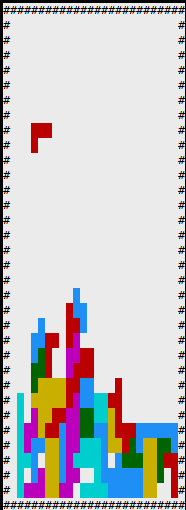

# rtt-tetris

用FinSH玩的俄罗斯方块。

## 简介

将[跨平台俄罗斯方块](https://github.com/volatile-static/CrossPlatformTetris)移植到RT-Thread，可以通过PuTTY或XShell游玩。



## API

```shell
Tetris.c
Tetris.h
```

这两个文件是从[跨平台俄罗斯方块](https://github.com/volatile-static/CrossPlatformTetris)复制过来的。总共只有6个函数接口：

```c
void NewGame(TCmd *Messenger);
void MoveLeft(TCmd *Messenger);
void MoveRight(TCmd *Messenger);
bool MoveDown(TCmd *Messenger);
void Transform(TCmd *Messenger);
bool GameOver(void);
```

每个函数的输出都是一个TCmd结构体，记录了发生变动的方块的坐标。

## 食用方式

在ENV工具的配置方法：

```
 RT-Thread online packages  --->
 	miscellaneous packages  --->
		games: games run on RT-Thread console  --->
        	[*] Tetris: An indie puzzle video game run on RT-Thread console
```

在终端下键入：

```shell
msh> tetris_demo
```

即可运行。


若要改变游戏速度，可以在命令后跟上方块下落的时间间隔，如：

```shell
msh >tetris_demo 200
```

表示俄罗斯方块每200毫秒下落一格。

- 在```tetris_demo.c```中有以下宏定义，可以自行修改键位：

```cpp
#define KEY_UP    ('w')
#define KEY_LEFT  ('a')
#define KEY_DOWN  ('s')
#define KEY_RIGHT ('d')
```

- 在```Tetris.h```中可以修改画布尺寸：

```cpp
// Horizon
#define SizeX 24
// Vertial
#define SizeY 32
```


## TODO

目前每次下落只能左右移动一格，计划采用多线程实现。

## 联系方式

- QQ：1043064987
